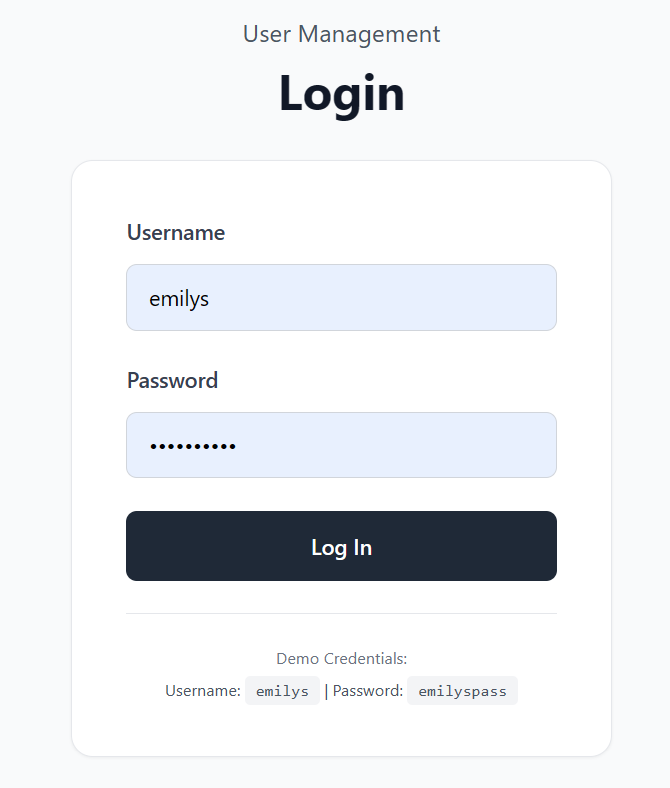
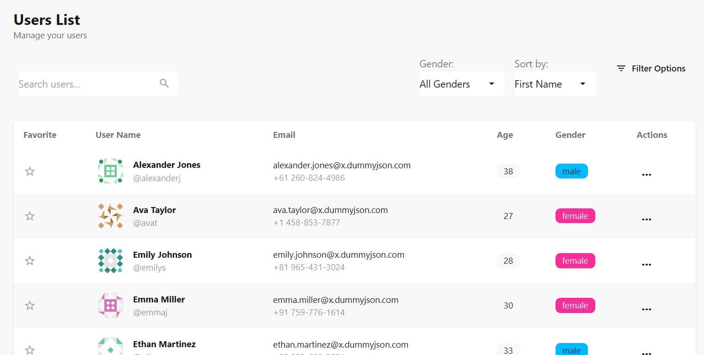
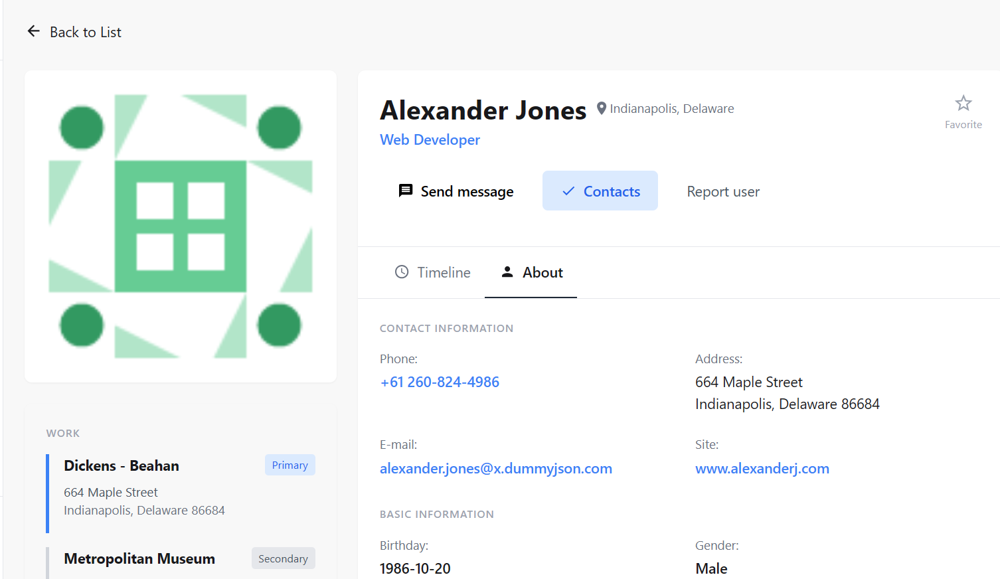
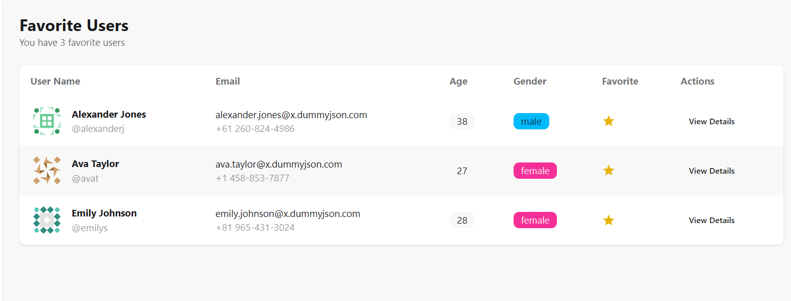

#  React User Management Dashboard

A full-featured ReactJS application for managing users using the DummyJSON API. Built to demonstrate authentication, protected routing, persistent state, and responsive UI with DaisyUI.

---

## Features

- Authentication
    - Login via the DummyJSON API
    - Token and refresh-token management
    - Persistent session across reloads

- User management
    - Protected route: `/users`
    - Search, sort, and pagination
    - Responsive table layout with avatars
    - View user details at `/users/:id`

- Favorites
    - Mark/unmark users as favorites
    - Persistent favorites using Context + `localStorage`
    - View favorites at `/favorites`

- Preferences
    - Light/dark theme toggle
    - Items-per-page selector
    - Reset preferences button
    - Fully persistent via `localStorage`

- Architecture
    - Context API for auth, preferences, and favorites
    - Axios for API calls
    - DaisyUI + TailwindCSS for styling
    - React Router v7 for routing

---

##  Tech Stack

| Tech         | Purpose                         |
|--------------|----------------------------------|
| React 19.1   | UI framework                    |
| React Router v7 | Routing                     |
| Axios        | API requests                    |
| DaisyUI      | UI components                   |
| TailwindCSS  | Utility-first styling           |
| DummyJSON API| User data and authentication    |

---

##  Installation

```bash
git clone https://github.com/Sudhir4500/User_Management.git
cd User_Management
npm install
npm run dev
```

# DummyJSON Test Credentials
- Username: `emilys`
- Password: `emilyspass`

---

# Routes Overview
| Route          | Component       | Protected | Description                        |
|----------------|-----------------|-----------|------------------------------------|
| `/login`       | `Login`         | No        | Login page                         |
| `/users`       | `UserList`      | Yes       | List of users with search, sort, pagination |
| `/users/:id`   | `UserDetails`   | Yes       | Detailed view of a single user     |
| `/favorites`   | `Favorites`     | Yes       | List of favorite users             |

# Screenshots






# Deployment
The app is deployed on Vercel and can be accessed [here](https://user-management-nine-phi.vercel.app/login).